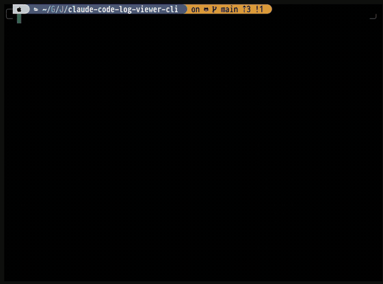

# cclv - Claude Code Log Viewer

A terminal UI for browsing and viewing Claude Code conversation logs.


[](https://github.com/JeiKeiLim/claude-code-log-viewer-cli/releases/latest)



Browse your Claude Code projects, select a conversation, and view the full message history with collapsible thinking sections and tool call details — all from your terminal.

## Features

- **Interactive Project Browser** - Navigate all your Claude Code projects from `~/.claude/projects/`
- **Conversation Timeline** - Browse conversations sorted by most recent
- **Log Viewer** - View messages with markdown rendering and proper text wrapping
- **Dashboard Mode** - Monitor up to 9 projects simultaneously in a grid layout
- **Watch Mode** - Real-time updates as conversations grow (`-w` flag)
- **Usage Limit Monitor** - View Claude Code API usage limits in TUI status bar or via `--usage` flag
- **Developer Power Tools** - Line numbers, raw JSONL mode, vim-style `:N` navigation
- **Token Statistics** - View token counts per message and conversation totals
- **Vim-style Navigation** - `j/k`, `gg/G`, `/search`, and more
- **CJK Support** - Proper display of Korean, Japanese, and Chinese characters
- **Pipeline Mode** - Pipe JSONL logs directly: `cat file.jsonl | cclv`
- **Plain Text Output** - Export logs without TUI for scripting

## Installation

### Download Binary (Recommended)

Download the latest release for your platform from [GitHub Releases](https://github.com/JeiKeiLim/claude-code-log-viewer-cli/releases/latest).

**macOS (Apple Silicon):**
```bash
curl -Lo cclv.tar.gz https://github.com/JeiKeiLim/claude-code-log-viewer-cli/releases/latest/download/cclv_darwin_arm64.tar.gz && mkdir -p ~/.local/bin && tar -xzf cclv.tar.gz -C ~/.local/bin cclv && rm cclv.tar.gz
```

**macOS (Intel):**
```bash
curl -Lo cclv.tar.gz https://github.com/JeiKeiLim/claude-code-log-viewer-cli/releases/latest/download/cclv_darwin_amd64.tar.gz && mkdir -p ~/.local/bin && tar -xzf cclv.tar.gz -C ~/.local/bin cclv && rm cclv.tar.gz
```

**Linux (amd64):**
```bash
curl -Lo cclv.tar.gz https://github.com/JeiKeiLim/claude-code-log-viewer-cli/releases/latest/download/cclv_linux_amd64.tar.gz && mkdir -p ~/.local/bin && tar -xzf cclv.tar.gz -C ~/.local/bin cclv && rm cclv.tar.gz
```

**Linux (arm64):**
```bash
curl -Lo cclv.tar.gz https://github.com/JeiKeiLim/claude-code-log-viewer-cli/releases/latest/download/cclv_linux_arm64.tar.gz && mkdir -p ~/.local/bin && tar -xzf cclv.tar.gz -C ~/.local/bin cclv && rm cclv.tar.gz
```

> **Note:** Make sure `~/.local/bin` is in your PATH. If not, add this to your `~/.bashrc` or `~/.zshrc`:
> ```bash
> export PATH="$HOME/.local/bin:$PATH"
> ```

### Go Install

If you have Go installed:

```bash
go install github.com/JeiKeiLim/claude-code-log-viewer-cli/cmd/cclv@latest
```

### Build from Source

```bash
git clone https://github.com/JeiKeiLim/claude-code-log-viewer-cli.git
cd claude-code-log-viewer-cli
make build
mv cclv ~/.local/bin/
```

## Usage

### Interactive Mode

Simply run `cclv` to browse all your Claude Code projects:

```bash
cclv
```

This opens an interactive browser where you can:
1. Select a project from the list
2. Choose a conversation session
3. View the full conversation log

### View a Specific File

```bash
cclv path/to/conversation.jsonl
```

### Pipeline Mode

```bash
cat conversation.jsonl | cclv
```

### Plain Text Output

```bash
# Force plain text output (no TUI)
cclv --plain conversation.jsonl

# Pipe to other tools
cclv --plain conversation.jsonl | grep "error"

# Force TUI even when piping
cat file.jsonl | cclv --tui
```

### Watch Mode

Monitor a conversation in real-time as it grows:

```bash
# Watch a specific file
cclv -w conversation.jsonl

# From interactive mode, press 'w' on a conversation to watch it
```

### Dashboard Mode

Monitor multiple projects simultaneously:

1. Run `cclv` to open the project browser
2. Press `Space` to select projects (up to 9)
3. Press `Enter` to open dashboard view

The dashboard displays a grid layout that auto-sizes based on selection count:
- 1 project: Full screen
- 2-3 projects: 1 row
- 4 projects: 2x2 grid
- 5-6 projects: 2x3 grid
- 7-9 projects: 3x3 grid

Each pane shows the latest conversation and updates in real-time.

### Color Output

By default, colors are disabled when output is piped. Use `--color` to control this:

```bash
# Auto-detect (default) - colors when TTY, no colors when piped
cclv --plain conversation.jsonl

# Force colors even when piping
cclv --plain --color=always conversation.jsonl | cat

# Disable colors completely
cclv --plain --color=never conversation.jsonl
```

### Version Information

```bash
# Show version
cclv --version
cclv -v
```

### Usage Information

Check your Claude Code API usage limits directly from the terminal:

```bash
# Show current usage (requires Claude Code credentials)
cclv --usage
cclv -u
```

This displays your daily token usage, reset time, and usage percentage. Useful for monitoring limits in scripts or checking before starting long sessions.

### Streaming Plain Mode

For integration with external tools, combine watch and plain modes:

```bash
# Stream formatted output continuously
cclv --watch --plain conversation.jsonl

# With color output for tools that support ANSI
cclv --watch --plain --color=always conversation.jsonl
```

New entries appear formatted in real-time. The process continues until interrupted with Ctrl+C.

## Keyboard Shortcuts

### Project List

| Key | Action |
|-----|--------|
| `j` / `k` | Navigate down / up |
| `Enter` / `l` | Select project |
| `Space` | Toggle project selection (for dashboard) |
| `g` / `G` | Jump to top / bottom |
| `/` | Filter list |
| `q` | Quit |

### Conversation List

| Key | Action |
|-----|--------|
| `j` / `k` | Navigate down / up |
| `Enter` / `l` | Open conversation |
| `w` | Open with watch mode |
| `h` / `Esc` | Go back |
| `g` / `G` | Jump to top / bottom |
| `/` | Filter list |
| `q` | Quit |

### Log Viewer

| Key | Action |
|-----|--------|
| `j` / `k` | Scroll down / up |
| `d` / `u` | Half page down / up |
| `gg` / `G` | Jump to top / bottom |
| `:N` | Jump to line/entry N |
| `/` | Search |
| `n` / `N` | Next / previous match |
| `t` | Toggle thinking blocks |
| `i` | Toggle tool inputs |
| `r` | Toggle raw JSONL mode |
| `p` | Show file path (toast) |
| `h` / `Esc` | Go back |
| `q` | Quit |

### Dashboard

| Key | Action |
|-----|--------|
| `h` / `j` / `k` / `l` | Navigate between panes |
| Arrow keys | Navigate between panes |
| `Enter` | Open focused pane in viewer |
| `r` | Refresh focused pane |
| `Esc` | Return to project list |
| `q` | Quit |

### Global (All Views)

| Key | Action |
|-----|--------|
| `R` | Refresh Claude Code usage limit |
| `q` | Quit |

## Message Types

The viewer renders different message types with distinct styling:

- **User messages** - Your prompts and questions
- **Assistant responses** - Claude's text responses with markdown rendering
- **Thinking blocks** - Claude's reasoning (collapsible with `t`)
- **Tool use** - Tool calls and inputs (collapsible with `i`)

Each message displays token usage when available:
- `Tokens: 1,234 (from log)` - Actual token count from Claude's API response
- `Tokens: ~1,200 (estimated)` - Calculated estimate using tiktoken

The status bar shows conversation totals with a `~` prefix when any tokens are estimated.

## How It Works

Claude Code stores conversation logs in `~/.claude/projects/` as JSONL files. Each project directory is named using an encoded path format. `cclv` automatically:

1. Scans the projects directory
2. Decodes project paths (handles hyphens, underscores, and special characters)
3. Parses JSONL conversation logs
4. Renders them in a TUI

## Requirements

- Go 1.21 or later
- Terminal with ANSI color support

## License

MIT

## Acknowledgments

Built with:
- [Bubble Tea](https://github.com/charmbracelet/bubbletea) - TUI framework
- [Lip Gloss](https://github.com/charmbracelet/lipgloss) - Style definitions
- [Bubbles](https://github.com/charmbracelet/bubbles) - TUI components
- [Glamour](https://github.com/charmbracelet/glamour) - Markdown rendering
- [fsnotify](https://github.com/fsnotify/fsnotify) - File system notifications
- [tiktoken-go](https://github.com/pkoukk/tiktoken-go) - Token counting
